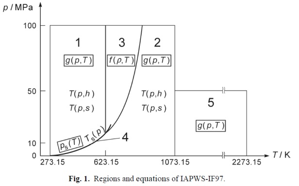

# IF97 Python

Высокопроизводительная Python библиотека для расчета термодинамических свойств воды и пара по стандарту IAPWS IF97.

## Особенности

- **Высокая производительность** - Векторизованные вычисления с использованием Numba
- **Поддержка массивов** - Работа со скалярами и массивами
- **Научная точность** - Полное соответствие стандарту IAPWS IF97
- **Простой API** - Интуитивно понятный интерфейс
- **Мультирегионная поддержка** - Поддержка регионов воды и пара (регионы 3-4 в разработке)

## Установка
### Способ 1: Установка из репозитория (требуется Git)
```bash
pip install git+https://github.com/Sam-Strand/if97_py.git
```

### Способ 2: Установка готового пакета (без Git)
```bash
pip install https://github.com/Sam-Strand/if97_py/releases/download/v1.0.0/if97_py-1.0.0-py3-none-any.whl
```

## Соотношение регионов IAPWS-IF97



Согласно модели IAPWS-IF97, свойства воды и пара рассчитываются по разным уравнениям в зависимости от фазового состояния:

| № | Обозначение |  Описание (RU) |
|---|-------------|----------------|
| 1 | **Water**   | Вода |
| 2 | **Steam**   | Перегретый пар |
| 3 | **Fluid**   | Сверхкритическая жидкость/флюид |
| 4 | **Mix**     | Пароводяная смесь |

## Быстрый старт
```python
from if97_py import if97

# Определение региона по температуре и давлению
region = if97.regionTP(30 + 273.15, 0.101325)  # 30°C, 0.1 МПа
print(f"Регион: {region}")  # Регион: 1

# Расчет давления насыщения
p_sat = if97.saturationPressureT(100 + 273.15)  # 100°C
print(f"Давление насыщения при 100°C: {p_sat:.4f} МПа")  # 0.1014 МПа

# Расчет температуры насыщения
t_sat = if97.saturationTempP(0.101325)  # 0.1 МПа
print(f"Температура насыщения: {t_sat - 273.15:.2f} °C")  # 99.97 °C

# Работа с массивами
temperatures = [300, 400, 500]  # K
pressures = [0.101325, 0.201325, 0.301325]  # МПа
regions = if97.regionTP(temperatures, pressures)
print(f"Регионы: {regions}")  # [1, 2, 2]
```
